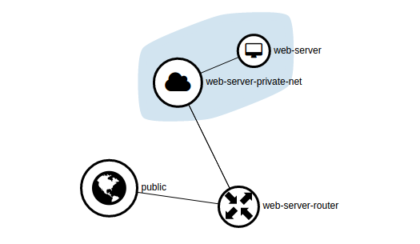

# Laboratorio: example-1

## Objetivos
En este laboratorio debemos conseguir los siguientes objetivos:

1. Crear una máquina que realice tareas de servidor web.
2. Esta máquina debe pertenecer a una red privada con IPs del tipo 10.0.10.x
3. Esta máquina debe poder ser accedida mediante SSH.
4. Esta máquina debe responder al comando ***ping***.
5. Esta maquina debe disponer de una ip flotante que pudiera ser accedida desde una red exterior o internet

## Esquema de red deseado

