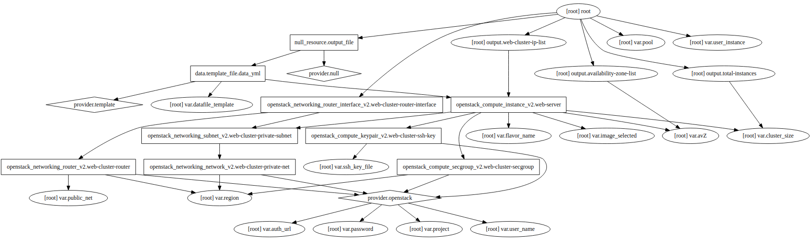
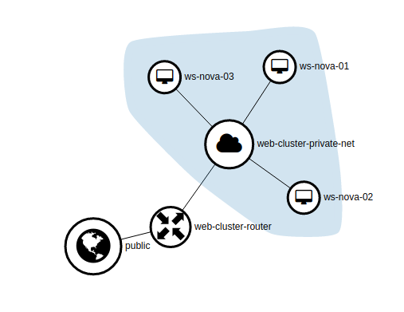
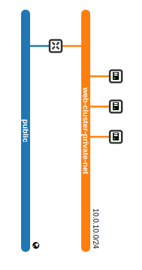
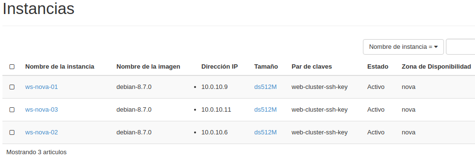
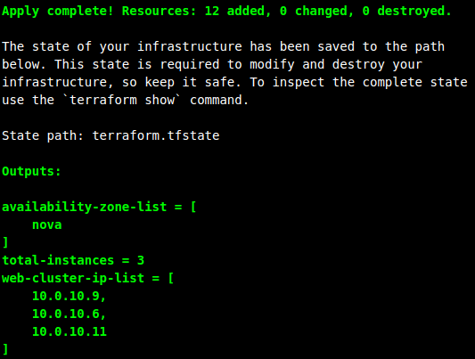
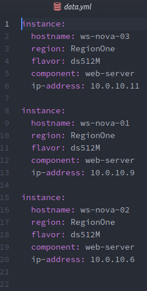

# Laboratorio: example-3

## Objetivos
En este laboratorio debemos conseguir los siguientes objetivos:

1. Crear un cluster de máquinas que realice tareas de servidor web.
2. Parámetrizar el numero de máquinas que forman el cluster.
3. Crear tres instancias por zona de disponibilidad.
4. Todas las máquinas deben pertenecer a una red privada con IPs del tipo 10.0.10.x
5. Todas las máquinas deben poder ser accedidas mediante SSH.
6. Todas las máquinas deben responder al comando ***ping***.
7. El nombre de la máquinas se debe ajustar al patron "ws-zona de disponibilidad-XX".
8. Generar un fichero yml con datos relevantes de las maquinas que forman el cluster.

### Grafo generado por Terraform

### Esquema de red deseado

### Instancias creadas

### Outputs

### Fichero de resultados

